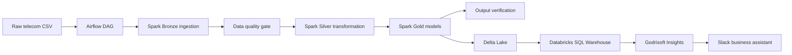
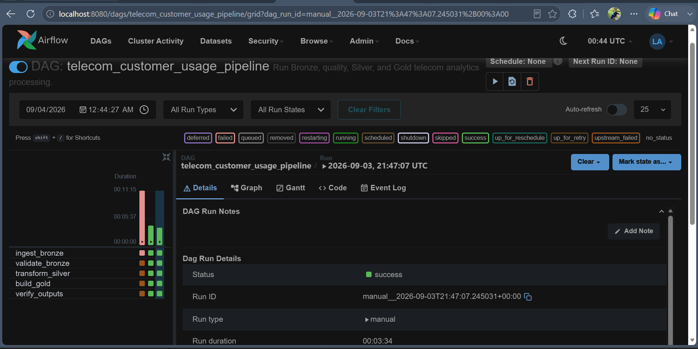
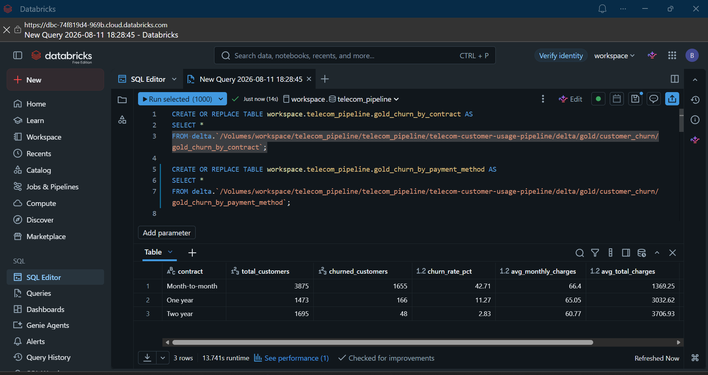
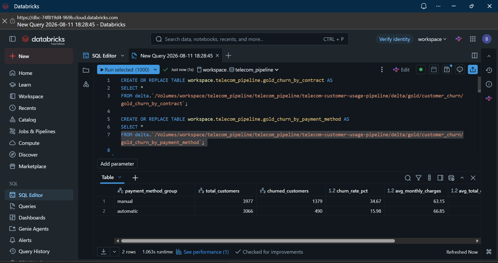
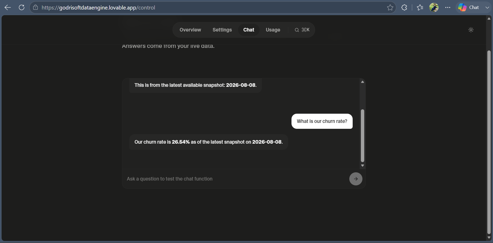
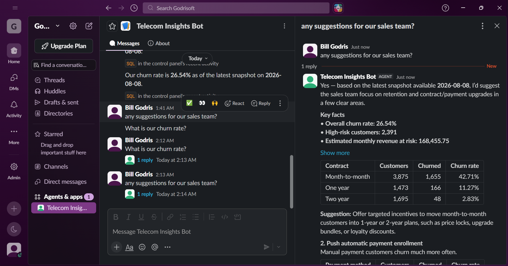
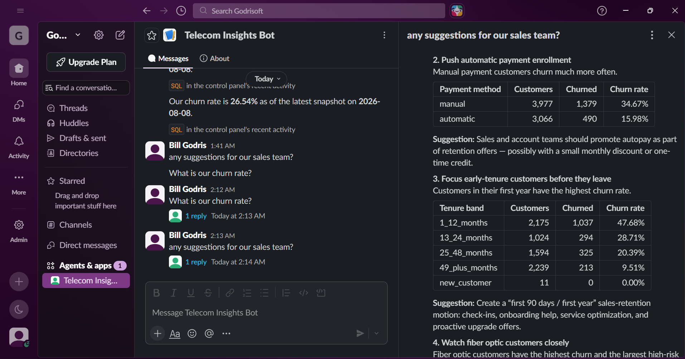
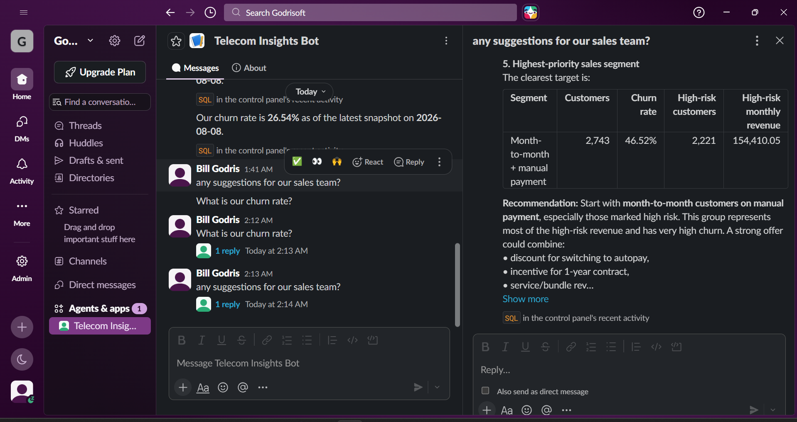

# Telecom Customer Usage Data Engineering Pipeline

Production-style portfolio project that turns telecom customer churn data into validated business metrics using Docker, Airflow, Spark, Delta Lake, Databricks SQL, Godrisoft Insights, and Slack.

## Business Outcome

The pipeline gives analysts and executives a governed path from source data to answers they can use. The current implementation measures customer churn, revenue exposure, contract risk, payment-method risk, tenure patterns, and high-risk customer segments.

Verified executive KPIs:

| KPI | Value |
| --- | ---: |
| Total customers | 7,043 |
| Churned customers | 1,869 |
| Overall churn rate | 26.54% |
| Average monthly charge | 64.76 |
| Estimated monthly revenue | 456,116.60 |

## Architecture



The local pipeline writes Parquet outputs for direct inspection and Delta copies for the cloud handoff. Databricks SQL exposes only approved Gold tables to Godrisoft Insights. Slack is the conversational delivery channel for governed answers.

See [docs/architecture.md](docs/architecture.md) for component boundaries and data flow details.

## Technology Stack

- Docker Compose for reproducible local infrastructure
- Apache Airflow 2.10.5 for orchestration, retries, and run history
- Apache Spark 3.5.x and PySpark for distributed transformations
- Delta Lake for transaction-backed lakehouse tables
- PostgreSQL 16 for Airflow metadata and local support schemas
- Databricks SQL Warehouse for governed analytics access
- Godrisoft Insights for semantic metrics and business-facing data chat
- Slack for executive and team access to approved metrics
- Pytest and Spark verification jobs for regression checks

## Implemented Pipeline

The Airflow DAG `telecom_customer_usage_pipeline` runs five tasks in sequence:

```text
ingest_bronze
-> validate_bronze
-> transform_silver
-> build_gold
-> verify_outputs
```

Layer responsibilities:

- Raw: original customer churn CSV supplied locally.
- Bronze: standardized source records with ingestion metadata and source-quality flags.
- Silver: cleaned, typed, validated, and enriched customer records.
- Gold: business-ready KPIs, churn segments, and customer risk outputs.
- Delta: local transaction-backed copies prepared for Databricks registration.

## Gold Tables

The project produces and exposes these approved analytics tables:

- `gold_churn_by_contract`
- `gold_churn_by_tenure_band`
- `gold_churn_by_payment_method`
- `gold_customer_risk_summary`
- `gold_executive_kpis`

Raw and Bronze data are not exposed to the business-facing assistant.

## Verified Results

The completed validation established:

- Two consecutive Airflow DAG runs succeeded, proving repeatable overwrite behavior.
- Bronze contains 7,043 rows and 25 columns.
- Silver contains 7,043 rows and no null `total_charges` values.
- All five Gold tables were readable and passed output verification.
- Seven Parquet `_SUCCESS` markers were present: one Bronze, one Silver, and five Gold.
- No critical Bronze data-quality checks failed.
- Three repository regression tests passed.
- Databricks SQL returned the expected executive KPI row.
- Godrisoft Insights returned the validated 26.54% churn rate.
- Slack received and answered business questions through Godrisoft Insights.

## Evidence

### Airflow Orchestration



### Databricks Analytics

<details>
<summary>View validated Databricks Gold-table evidence</summary>





</details>

### Godrisoft Insights



### Slack Business Assistant



<details>
<summary>View additional Slack decision-support evidence</summary>

#### Retention Drivers

The assistant compares payment-method and tenure segments, then translates the results into retention actions.



#### Priority Sales Segment

The assistant identifies the highest-priority segment and recommends a focused retention offer.



</details>

The screenshots contain no tokens, passwords, signing secrets, or Databricks client secrets.

## Local Setup

Prerequisites:

- Docker Desktop with Docker Compose
- At least 4 GB of memory available to Docker
- PowerShell on Windows, or an equivalent shell

Create the local environment file:

```powershell
Copy-Item .env.example .env
```

Place the source CSV at:

```text
data/raw/customer_churn/telco_customer_churn.csv
```

Start the platform:

```powershell
docker compose up -d --build
```

Local interfaces:

- Airflow: `http://localhost:8080`
- Spark master: `http://localhost:8081`
- Spark worker: `http://localhost:8082`
- PostgreSQL: `localhost:5433`

The demonstration Airflow credentials are defined by the local Compose configuration and must be replaced outside local development.

## Run the Pipeline

Run the complete local demonstration with one command:

```powershell
.\scripts\run_demo.ps1
```

The script validates the local prerequisites, starts or rebuilds the Docker Compose platform, waits for Airflow, checks DAG imports, triggers a uniquely named run, monitors it to completion, prints all task states, and runs the repository validation tests. Existing containers and data are preserved.

For a faster repeat demonstration when the images are already built:

```powershell
.\scripts\run_demo.ps1 -SkipBuild
```

The source CSV must exist at `data/raw/customer_churn/telco_customer_churn.csv` before running the command.

### Manual Alternative

Open Airflow, enable `telecom_customer_usage_pipeline`, and select **Trigger DAG**. Alternatively:

```powershell
docker compose exec -T airflow-scheduler `
  python -m airflow dags trigger telecom_customer_usage_pipeline
```

Monitor the run in Airflow until all five tasks are green.

## Validation

Run the fast repository checks:

```powershell
python -m pytest -q
```

Run layer verification through the Spark cluster:

```powershell
docker compose exec -T airflow-scheduler `
  spark-submit --master spark://spark-master:7077 `
  /opt/telecom-pipeline/spark_jobs/verify_bronze_customer_churn.py

docker compose exec -T airflow-scheduler `
  spark-submit --master spark://spark-master:7077 `
  /opt/telecom-pipeline/spark_jobs/verify_silver_customer_churn.py

docker compose exec -T airflow-scheduler `
  spark-submit --master spark://spark-master:7077 `
  /opt/telecom-pipeline/spark_jobs/verify_gold_customer_churn.py
```

Data-quality evidence is written to `reports/data_quality/` as JSON and Markdown.

## Databricks and Business Access

Local Delta outputs can be uploaded and registered with:

```powershell
python .\scripts\upload_delta_to_databricks.py --scope gold --register-tables
```

Databricks credentials belong only in the ignored `.env` file. The service principal should receive least-privilege access to the selected catalog, schema, SQL warehouse, and Gold tables.

Godrisoft Insights queries the Databricks SQL Warehouse through that read-only identity. Its Slack endpoint validates Slack request signatures, processes events asynchronously, and replies with metrics from the same semantic layer used by the in-app chat.

## Data Quality

The Bronze quality gate covers:

- Completeness
- Uniqueness
- Validity
- Accuracy
- Consistency
- Timeliness

A critical failure stops the DAG before Silver and Gold processing. See [docs/data-quality.md](docs/data-quality.md).

## Security and Repository Hygiene

- `.env` is ignored; `.env.example` contains placeholders only.
- Raw source data and generated Parquet/Delta outputs are ignored.
- Tokens, client secrets, Slack signing secrets, and OAuth credentials must never be committed.
- Only sanitized screenshots and bounded quality reports are intended as portfolio evidence.
- Production deployments must replace demonstration passwords and apply organization-specific access controls.

## Project Structure

```text
airflow/                 Airflow image
dags/                    Airflow orchestration
data/                    Ignored local inputs and generated layers
docker/postgres/init/    PostgreSQL initialization
docs/                    Architecture and implementation notes
reports/                 Bounded data-quality evidence
scripts/                 Profiling and Databricks upload utilities
spark_jobs/              Bronze, Silver, Gold, Delta, and verification jobs
tests/                   Fast regression tests
```

## Further Documentation

- [Docker platform](docs/docker-platform.md)
- [Bronze ingestion](docs/bronze-ingestion.md)
- [Data quality](docs/data-quality.md)
- [Silver transformation](docs/silver-transformation.md)
- [Gold analytics](docs/gold-analytics.md)
- [Delta Lake](docs/delta-lake.md)
- [Databricks upload](docs/databricks-upload.md)
- [Source inventory](docs/source-inventory.md)
