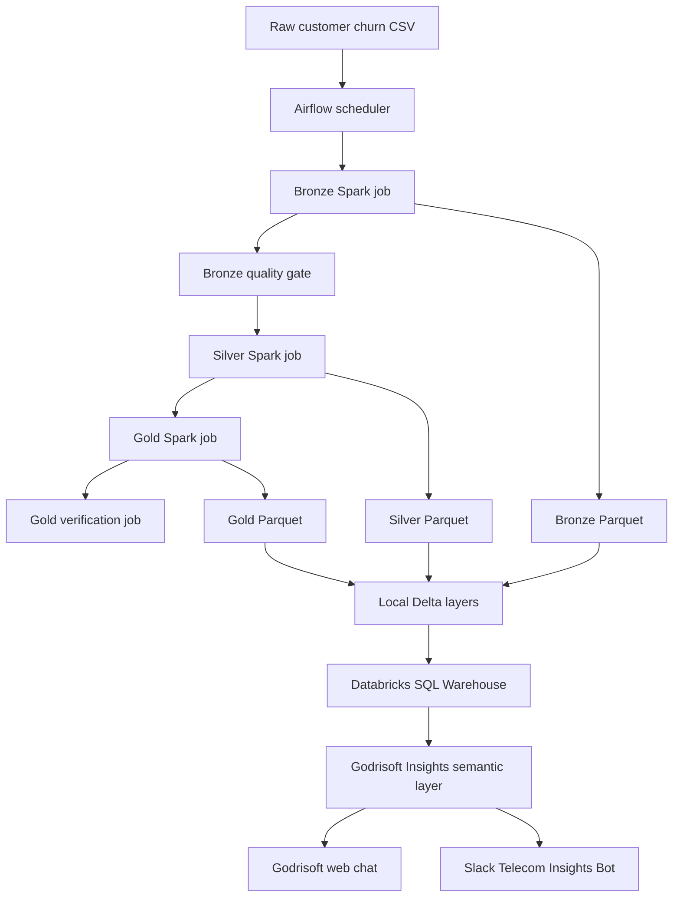

# Architecture

## System Overview



## Verified Runtime Flow

The implemented Airflow DAG is intentionally small and observable:

```text
ingest_bronze
-> validate_bronze
-> transform_silver
-> build_gold
-> verify_outputs
```

Two consecutive manual runs completed successfully. The second run overwrote and reproduced the outputs without duplicate records or filesystem-permission failures.

## Component Responsibilities

### Docker Compose

Docker Compose provides a reproducible local platform:

- `postgres`: Airflow metadata database and local support schemas
- `spark-master`: Spark standalone coordinator
- `spark-worker`: Spark executor
- `airflow-init`: database migration and local admin initialization
- `airflow-webserver`: Airflow user interface
- `airflow-scheduler`: task scheduling and Spark submission

The scheduler and Spark runtime use a compatible UID for shared `data` and `reports` bind mounts. This allows Spark overwrite operations without world-writable permissions.

### Airflow

Airflow owns orchestration, dependency order, retries, logs, and run history. It submits Spark applications but does not perform transformations itself.

The DAG stops at the Bronze quality gate when a critical rule fails. Downstream tasks run only after their dependencies succeed.

### Spark

Spark performs ingestion, validation, transformation, aggregation, and output verification using DataFrames and built-in functions.

Current processing includes:

- source-column normalization
- typed billing and tenure fields
- blank `total_charges` tracking and correction
- uniqueness and domain validation
- churn flags and tenure bands
- payment-method grouping
- active-service counts
- contract, payment, tenure, customer-risk, and executive aggregations

### Storage Layers

- Raw retains the locally supplied source file.
- Bronze preserves source-aligned records with ingestion metadata and quality flags.
- Silver contains cleaned and enriched customer-level records.
- Gold contains approved business aggregates and customer-risk outputs.
- Delta provides transaction logs and cloud-ready copies of the same logical layers.

Generated data is deliberately excluded from Git. Only directory placeholders and bounded validation reports are tracked.

### PostgreSQL

PostgreSQL supports Airflow metadata and creates local `bronze`, `silver`, `gold`, and `quality` schemas for extension work. It is not the production analytics serving layer in the current implementation.

### Databricks SQL Warehouse

Databricks is the governed serving layer. The approved Gold tables are registered in `workspace.telecom_pipeline` and queried through a SQL Warehouse:

- `gold_churn_by_contract`
- `gold_churn_by_tenure_band`
- `gold_churn_by_payment_method`
- `gold_customer_risk_summary`
- `gold_executive_kpis`

The Godrisoft service principal receives only the catalog, schema, warehouse, and table permissions needed for read access.

### Godrisoft Insights

Godrisoft Insights is the semantic and business-facing layer. It maps natural-language questions to approved metrics and Gold tables rather than exposing raw datasets directly.

The verified in-app response reports an overall churn rate of 26.54%, matching the local and Databricks KPI validations.

### Slack

Slack provides a conversational interface to the same Godrisoft semantic layer. The production integration uses:

- a verified HTTPS Events API endpoint
- Slack request-signature validation
- `message.im` and `app_mention` subscriptions
- asynchronous event processing
- `chat.postMessage` replies
- tenant resolution from the Slack workspace

The final end-to-end test returned validated KPI facts, segmented churn tables, and sales recommendations in Slack.

## Data Quality Controls

The Bronze gate validates six quality dimensions:

- Completeness: required fields and ingestion metadata are populated.
- Uniqueness: customer identifiers are not duplicated.
- Validity: categorical and numeric values follow allowed domains.
- Accuracy: values satisfy expected business ranges.
- Consistency: related fields agree, including blank charge handling.
- Timeliness: ingestion timestamps are available for freshness checks.

The verified report contains 7,043 rows, 25 columns, and zero failed critical checks.

## Reliability Controls

- Airflow retries transient task failures.
- Spark outputs use deterministic overwrite semantics.
- Shared filesystem identities prevent cross-container ownership conflicts.
- `_SUCCESS` markers prove completed Parquet writes.
- Delta transaction logs support reliable versioned tables.
- Slack events are signature-validated, deduplicated, and processed asynchronously.
- Verification jobs and Pytest checks detect output regressions.

## Security Boundaries

- Raw and Bronze data remain outside the business assistant.
- Godrisoft receives read-only access to approved Gold tables.
- Databricks tokens and service-principal secrets remain in ignored environment configuration.
- Slack bot tokens and signing secrets remain in the deployed secret store.
- Repository screenshots must not expose credentials or private configuration values.
- Local demonstration passwords must be replaced for any non-local deployment.

## Verified Evidence

- Healthy Docker services for PostgreSQL, Spark, and Airflow
- Registered Airflow DAG with no import errors
- Two successful end-to-end DAG runs
- Bronze and Silver row/schema verification
- Five verified Gold tables
- Seven Parquet `_SUCCESS` markers
- Zero failed critical data-quality checks
- Three passing regression tests
- Matching Databricks and Godrisoft KPI results
- Successful Slack response through the semantic layer

Screenshots are stored under `docs/screenshots/` and referenced from the project README.
